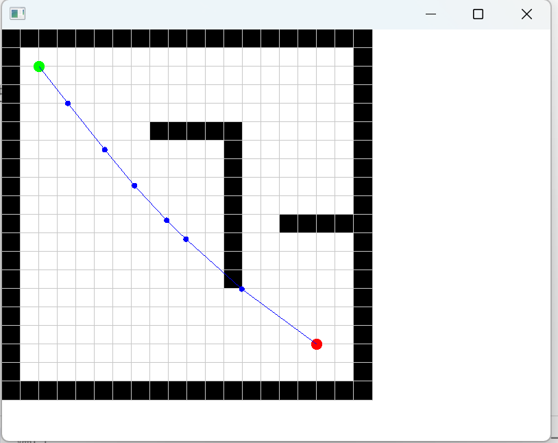

# RoboNavPlanner: 混合A*与PSO的机器人路径规划器
(Hybrid A*-PSO Robot Path Planner)

`RoboNavPlanner` 是一个用 C++17 实现的模块化机器人路径规划系统。它采用创新的 **混合A\*与粒子群优化 (Hybrid A*-PSO) 算法**，在包含障碍物的二维地图中，高效地寻找从起点到终点的平滑、无碰撞路径。

项目提供两种模式，以适应不同需求：
* **图形化版本 (SFML Version)**: 提供动态、直观的可视化界面，能同时展示 A\* 算法生成的全局引导路径和 PSO 算法的最终优化路径。
* **控制台版本 (Console Version)**: 无图形库依赖，可在任何标准终端中运行，通过 ASCII 字符展示地图和路径，便于快速测试与验证。


*SFML 图形化版本输出*

## 核心特性

-   **创新混合算法**: 结合 A\* 算法的全局搜索能力和 PSO 算法的局部优化能力，显著提升路径质量和收敛速度。
-   **高度解耦的架构**: 采用**策略 (Strategy) 设计模式**，将路径规划算法与核心逻辑分离，使得添加或切换新算法（如 RRT\*, Dijkstra）变得轻而易举。
-   **双版本支持**: 通过 CMake 和预处理器宏 (`USE_SFML`, `CONSOLE_VERSION`) 实现条件编译，从单一代码库生成图形和控制台两个版本。
-   **外部参数配置**: 所有关键参数（如PSO迭代次数、粒子数量、航点数等）均可通过 `data/config/pso_config.json` 文件进行配置，无需重新编译即可调整算法行为。
-   **现代化 C++ 实践**: 项目广泛使用 C++17 标准，包括智能指针 (`std::unique_ptr`)、`std::function` 等，保证了代码的健壮性和可维护性。
-   **自定义地图**: 支持从文本文件加载自定义地图布局。

## 快速开始

### 依赖项
-   C++17 编译器 (例如 MinGW, GCC, Clang)
-   CMake (版本 >= 3.16)
-   SFML 图形库 (仅图形化版本需要)

### 构建与运行

1.  **克隆或下载项目**

2.  **配置CMake**
    * 确保 SFML 库的路径在 `CMakeLists.txt` 中已正确设置 (默认为 `C:/Tools/SFML`)。
    * 创建构建目录并生成构建文件：
    ```bash
    mkdir build
    cd build
    cmake ..
    ```

3.  **编译项目**
    ```bash
    cmake --build .
    ```

4.  **运行程序**
    可执行文件位于 `build/bin/` 目录下。

    * **运行图形化版本:**
        ```bash
        # 如果提示缺少 DLL，请从 SFML 的 bin 目录复制到此目录下
        ./bin/RoboNavPlanner.exe
        ```

    * **运行控制台版本:**
        ```bash
        ./bin/RoboNavPlanner_Console.exe
        ```

### 控制台输出示例
控制台版本会使用 ASCII 字符清晰地展示地图、障碍物和最终路径。

=== 地图和路径可视化 ===
图例: S=起点, E=终点, *=路径, #=障碍物, .=可通行
```text
0 1 2 3 4 5 6 7 8 9 0 1 2 3 4 5 6 7 8 9
0 # # # # # # # # # # # # # # # # # # # #
1 # . . . . . . . . . . . . . . . . . . #
2 # . S . . . . . . . . . . . . . . . . #
3 # . . * . . . . . . . . . . . . . . . #
...
16 # . . . . . . . . . . . . . . . * . . #
17 # . . . . . . . . . . . . . . . . E . #
18 # . . . . . . . . . . . . . . . . . . #
19 # # # # # # # # # # # # # # # # # # # #
```

## 项目结构
```text
RoboNavPlanner/
├── CMakeLists.txt              # CMake 构建脚本
├── data/
│   ├── maps/map.txt            # 地图数据文件
│   └── config/pso_config.json  # 算法和应用配置文件
├── docs/                       # 项目文档
├── include/                    # 全局头文件 (如 Common.h, 算法接口)
├── src/                        # 源代码
│   ├── main.cpp                # SFML 版本主程序
│   ├── main_console.cpp        # 控制台版本主程序
│   ├── algorithm/              # 算法实现 (HybridAStarPSO, AStar, ZPSO)
│   ├── core/                   # 核心逻辑 (PathPlanner, Map)
│   ├── visualization/          # SFML 可视化器
│   └── config/                 # 配置管理器
└── build/                      # 编译输出目录
```
